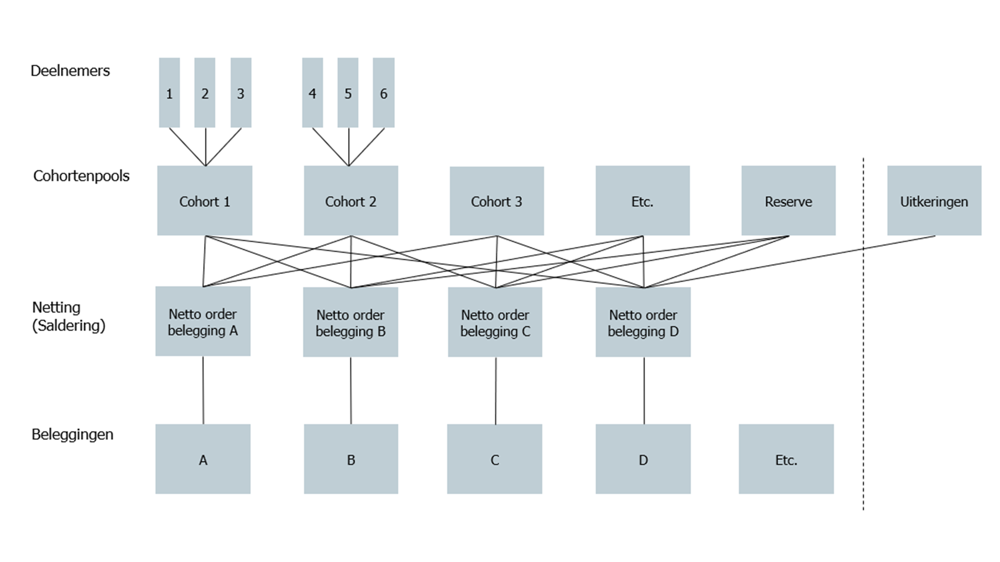
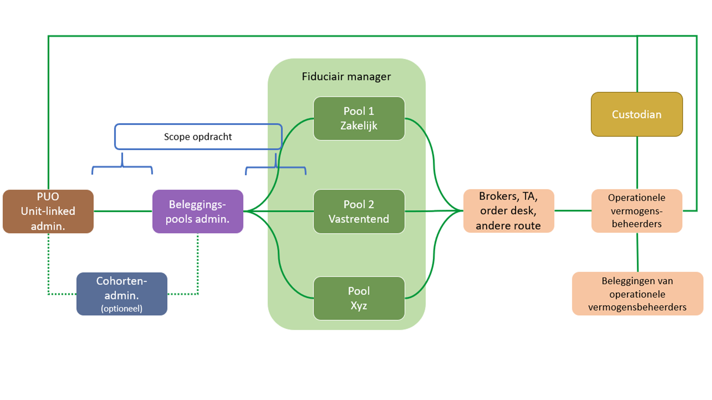
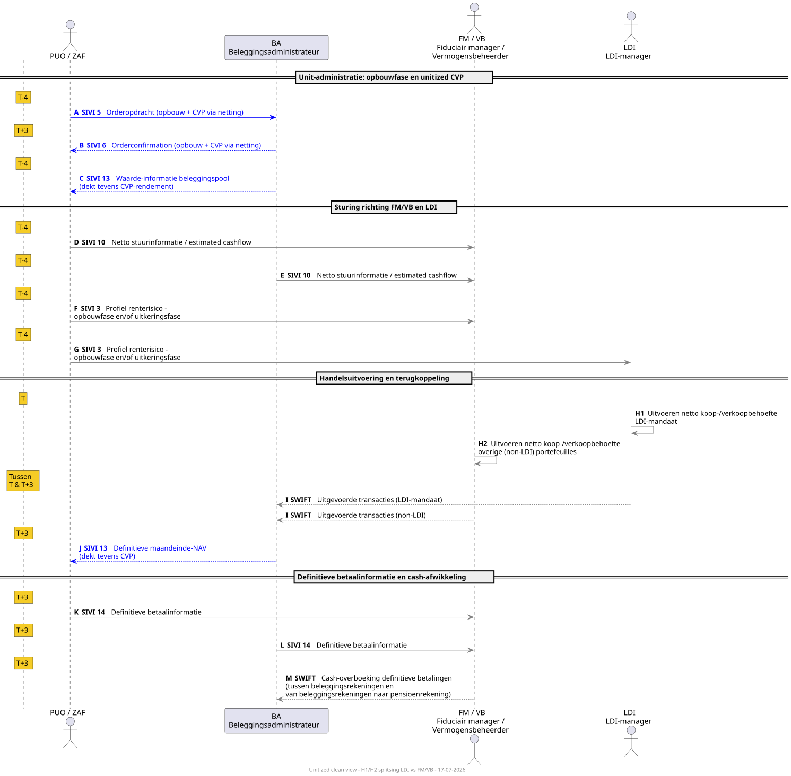
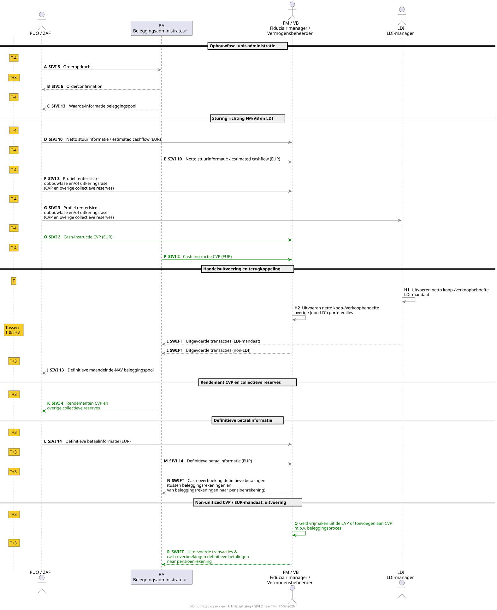

# 4 Processes & Information Flows – Flexible Premium Scheme

## 4.1 Introduction

This chapter describes the necessary information exchange between the involved parties to robustly implement the Flexible Premium Scheme. Based on the principles and the scope, the required data set has been established.

In directing the process of the Flexible Premium Scheme, a distinction can be made between two models for "ordering" investments that are applied in the operational cooperation between pension administration and asset management:

- Model 1, a simpler, direct order model and

- Model 2, a more extensive, layered order model.

A model is also conceivable in which the SPR data model can be used for FPR data exchange. In this model, FPR is structured similarly to SPR-actual where only multiple risk profiles per cohort are supported.

## 4.2 Model 1: Simpler, Direct Order Model

In this model (see Figure 2), the investments (bottom layer in Figure 2) consist only of investment funds that are directly tradable via a platform. These concern trading platforms (e.g. AllFunds, Fundsettle, etc.) where investment funds can be traded directly. This model is currently applied mainly for Individual DC schemes. The direct order model can be executed by the Pension Administration Organization (PUO) itself.

> **Figure 2 – Schematic representation of the direct order model**
>
> When applying this model, the PUO translates mutations at the participant level into the required (netted) transactions in the investment funds of operational asset managers and has them executed via a trading platform. Such a setup can also be implemented jointly with the asset service provider/custodian, where the PUO translates participant-level mutations into netted mutations and the asset service provider/custodian handles the execution of transactions in investment funds via a trading platform, see Figure 6 - Model 1b: the PUO gives investment orders to an intermediary (order platform: custodian, fiduciary**)**. When compiling the orders, aspects such as the minimum order size per investment product, the settlement cycle and the associated financial flows are taken into account.
>
> In the direct order model, the pension administrator is generally supported by the Fiduciary Manager (FM) regarding the design of the lifecycle(s) and their composition (selection and monitoring of underlying investments). Special attention should be paid to the process of changing the composition of investments (replacement of investment funds). Such changes result in transition activities for the pension administrator and/or asset service provider/custodian. More specifically: if an investment product (which can be an investment fund, a virtual pool, or a mandate) is replaced, removed, or added, the PUO will adjust and process this. If adjustments are made *within* an investment product, this is not relevant to the PUO and only affects the provider of the product.
>
> In the direct order model, a cohort pool consists of a group of participants who have the same investment allocation based on the lifecycle principle (less investment and interest rate risk as the retirement date/end of the investment horizon approaches). A cohort pool can be used to distinguish between participant groups. This can be based on time (age, period until retirement, etc.) but also on a characteristic such as active, deferred, disabled, etc. The number of pools is basically unlimited. As many pools are created as needed to distinguish the right participant groups that require their own investment mix. Below is a simple example with a division into three lifecycles based on birth years and the established allocation between equities and bonds. The administration of the cohort pool is optional and can be managed by the PUO, the Investment Administrator/asset service provider (BA), or elsewhere. The allocation of weights (percentages) is often determined by the FM.
>
> A cohort pool is an administrative grouping consisting of a group of participants who, for example based on the lifecycle principle, have the same investment allocation.

|  | **Lifecycle defensive** |  | **Lifecycle neutral** |  | **Lifecycle offensive** |  |
|----|----|----|----|----|----|----|
| **Cohort pool** | % Equities | % Bonds | % Equities | % Bonds | % Equities | % Bonds |
| Birth year 1987 | 90 | 10 | 95 | 5 | 100 | 0 |
| Birth year 1986 | 88 | 12 | 94 | 6 | 98 | 2 |
| Birth year 1985 | 86 | 14 | 93 | 7 | 96 | 4 |
| Birth year 1984 | 85 | 15 | 91 | 9 | 94 | 6 |
| Birth year 1983 | 84 | 16 | 89 | 11 | 92 | 8 |
| Birth year 1982 | 83 | 17 | 87 | 13 | 90 | 10 |
| Birth year 1981 | 82 | 18 | 85 | 15 | 88 | 12 |
| Birth year 1980 | 81 | 19 | 84 | 16 | 86 | 14 |
| Birth year 1979 | 80 | 20 | 82 | 18 | 84 | 16 |

**Figure 3 - Example of cohort pools and lifecycles**

The example in Figure 3 shows how birth years and thus ages can influence the allocation of investments within lifecycles.

When a participant ages by one year, a so-called age rebalance is performed. Each participant is placed in the next cohort pool.

The participant's investment mix is then adjusted to that of the new cohort. In the example above (Figure 3), regardless of the chosen risk profile, the share of equities is reduced and the share of bonds is increased. This leads to concrete buy and sell orders towards the product providers.

Another form of rebalancing is target-weight rebalancing. This can be performed when the actual allocation of investments falls outside pre-established bandwidths due to market movements. This form of rebalancing also leads to buy and sell orders.

A group (cohort) of participants can be composed in various ways. Generally, three aspects play a role:

- Age.

- Status.

- Investment profile.

For the age aspect, the following can be used, for example:

- Age.

- Period until retirement date/end of investment horizon.

- Birth year/month.

For status, a distinction can be made between:

- Accumulating versus decumulating.

- Active/Deferred/Disabled/Decumulating/etc.

Netting of investments takes place across the cohort pools according to the instructions for the investment transactions. In the direct order model, this takes place "in the spaghetti" (see Figure 2: Schematic representation of the direct order model) between the cohort pools and the investments. The risk-sharing reserve is considered a separate cohort pool that invests in investment products according to its own investment policy.

## 4.3 Model 2: More Extensive, Layered Order Model

In the "More extensive, layered model" (Figure 4), the investments can also consist of non-daily tradable and/or non-platform-tradable (illiquid) funds or investment mandates. This model is already applied for larger Collective Individual DC (CIDC) schemes.

**Figure 4 - Schematic representation of the layered order model**

**In this model:**

- Participants invest in cohort pools according to the chosen lifecycle and composition of cohorts. The cohort pools in turn invest in investment pools. These investment pools can consist of various underlying investments (liquid, illiquid, funds and mandates). The cohort pools invest in investment pools according to the strategic allocation within the cohort pools[^2]. To make the allocation to participants robust and traceable, units are issued and unit values are calculated for the various (layered) pools. The participant's assets can thus be traced exactly to the pro-rata share of the underlying investments. The layer with cohort pools is optional and can reflect the structure of the investment policy and/or the intended function separation. If this layer is absent, the PUO must administer per participant which participations in the various investment pools are held. In the simpler FPR Direct Order model, the cohort pools and/or investment pools are not needed.  
  The investments are then daily tradable and the prices are also available daily. As a simple example for a cohort pool, Figure 3 also applies, where "% Equities" and "% Bonds" are replaced by, for example, "% Return-seeking assets," "% Fixed income, short duration," "% Fixed income, long duration," etc.

- The allocation of returns can be done by the PUO or the administrator of the cohort pools and investment pools:

  - The PUO has the responsibility to explicitly allocate returns in accordance with the allocation rules set by the pension administrator to: the personal pension assets of participants, the risk-sharing reserve, any compensation deposit and possible other reserves. For this purpose, the PUO processes mutations in the participant base and the allocation of personal pension assets to cohort pools. When composing the cohort pools, the lifecycle chosen by the participant (offensive, neutral, defensive, etc.) is taken into account. Paid premiums and possible set-offs such as with the risk-sharing reserve are also considered. Based on these personal pension assets, benefits are projected in accordance with the pension administrator's principles. In addition, the PUO handles participant communication.

  - The administrator of cohort pools and investment pools processes the allocation and administration of cohort pools as provided by the PUO. In addition, they handle the allocation to investment pools (e.g. return-seeking assets, fixed income). For this purpose, both for the cohort pools and the investment pools, unit values are calculated and the number of units is administered. For cohort pools, we refer to these as participation values; for investment pools, as unit values. Premiums, withdrawals and rebalancings are included. This role can optionally also be performed by a PUO or by a BA/asset service provider. The participation values and the number of participations of the cohort pools form the basis for the PUO to explicitly allocate assets to participants. The administrator of cohort pools and investment pools receives monthly the positions from the leading administration of the BA of the investment pools, supplemented with the positions from the (shadow) administration of the FM. These positions are reconciled[^4] with the positions in the own administration of the administrator of cohort pools and investment pools.

- There can be a dual cohort administration. The first lies with the PUO and concerns the participant & cohort administration. The second lies with "an administrator," which can be the PUO, another specialized party, or the BA/asset service provider. In this second role, the relationship between the cohort pools and the investment pools is established. This latter administration can also be called a middle-office administration and is optional. If this does not apply, the PUO administers at the participant level in which investment pools the participant invests and provides the necessary information directly to the FM.

- The FM supports the pension administrator in establishing the integrated investment policy. They ensure the execution of this investment policy and direct the (operational) asset managers. The FM will also maintain a (shadow) investment administration.

- The asset managers manage parts of the portfolio. They are directed by the FM. It is possible that (for certain parts) the FM and the operational asset manager belong to the same organization.

- The BA/asset service provider (usually additional services from the custodian) provides independent investment administration of the investment pools for the pension administrator. This administration is fed by the settlement of mutations in the portfolio of the investment pool, executed by the operational asset managers who are instructed by the FM. This investment administration is reconciled with the (shadow) administration of the FM.

In the process for "Model 2: more extensive, layered order model," a distinction is made between an accumulation phase (left of the dotted line in Figure 4) and a payout phase (right in Figure 4).

Insofar as the payout phase is entirely placed with an insurer, the data exchange is out of scope of this elaboration. In that case, the insurer receives the participant's capital via an outgoing value transfer from the PUO, with which a pension benefit is purchased from the insurer.

The payout phase executed by a PUO is in scope. In the payout phase, participants have the choice of continuing to invest (with a variable pension benefit) or a fixed pension benefit. With a variable benefit, the pension fund can choose a model with an individual payout phase or a collective payout phase.

For an individual payout phase, the data exchange for the continued investment variant can be set up in the same way as for the accumulation phase (where at older ages, for example, more is invested in shorter-duration fixed income).

For a collective payout phase (all retirees in one cohort), for both fixed and variable benefits, aligning the interest rate sensitivity of the investments (in a matching portfolio) with the collective interest rate sensitivity of projected benefits is important. It is possible that the accumulation phase takes place in model 1 (direct order model) and the payout phase via model 2 (more extensive order model). It is also possible to choose to invest individually in the payout phase and later switch to a collective payout phase. This switch has no impact on the data fields and/or data exchange between parties.

For the payout phase (executed by a pension administrator), the FM will set up (the management of) a matching portfolio. For the required data exchange, the PUO sends on a periodic (expected monthly) basis per scheme the projected cash flows to be hedged per cohort pool to the FM. The data exchange will be structured in accordance with data exchange 1b from the SPR.

## 4.4 Information Flows FPR - Model 1 (1a and 1b)

The information exchange for model 1 can be split into a variant 1a where the PUO invests directly and a variant 1b where the PUO invests via an order platform. Strictly speaking, from the PUO's perspective there is no distinction between both variants, but for clarity both variants are explained separately. This is schematically and simplified shown in Figure 5 and Figure 6. Via a broker, a PUO could, for example, trade ETFs on behalf of the pension fund if these are part of the agreed investment mix.

<figure>

<figcaption>
<strong>Figure 5 - Model 1a: the PUO invests directly with various market parties</strong>
</figcaption>
</figure>

The data exchange, indicated as "scope" in Figure 5, takes place in this model between the PUO on one side and the various types of market parties on the other.

<figure>

<figcaption>
<strong>Figure 6 - Model 1b: the PUO gives investment orders to an intermediary (order platform: custodian, fiduciary)</strong>
</figcaption>
</figure>

Data exchange (scope) from Figure 6 takes place exclusively between PUO and order platform.

The data exchange for FPR model 1 (a and b) proceeds via the following 2 messages for order processing.

In addition to the order messages, the FPR also uses Message 2. Cashflow (0001b) for periodic cash flow information. For FPR use, the cash flow runs per investment portfolio via `pension.scheme → investment.portfolio → financialTransaction.cashflow`. In this fill pattern, `netAmount` and `netDate` are mandatory at the portfolio level. See [§6.4.3](../chapter-6-4-berichten/#643-berichtstructuur-2-cashflow-0001b) for the message structure.

### 4.4.1 Message 5. Order Instruction (00541)

Information flow from PUO to Brokers/Transfer Agents/Order Desks (model 1a and 1b)

This information flow from PUO to Brokers/Transfer Agents/Order Desks contains the minimum set of data required to send an order to an order processing party. A switch can also be executed with this message.

The PUO submits orders at the investment fund level. The provider of the fund executes the ordering in the underlying investments itself. This can include listed and illiquid investments, among others.

**Switch convention.** A switch consists of two linked orders: one with `buySellId` = `switchfrom` (the fund being exited) and one with `buySellId` = `switchto` (the fund being entered). The direction of the transaction follows exclusively from `buySellId`; `tradeAmount` and `tradeQuantity` are always specified as positive values. The two switch legs are linked to each other via `financialInformationRef`, which refers to the `refKey` of the other leg. The field `switchType` indicates whether it is a simultaneous (`one-day`) or sequential (`sequential`) switch. See GitHub issue [#115](https://github.com/Stichting-SIVI/VBPUOdsk/issues/115).

**Order instruction: `tradeAmount` or `tradeQuantity`.** Per individual trade instruction, exactly one of `tradeAmount` or `tradeQuantity` must be filled in. Filling in both fields simultaneously is not allowed; leaving both empty is also not allowed. If an instruction has both an amount and a quantity component, these are recorded as separate trade records. See GitHub issue [#116](https://github.com/Stichting-SIVI/VBPUOdsk/issues/116).

Functional elaboration into a message: see chapter 6 and specifically *6.4.6*.

### 4.4.2 Message 6. Order Confirmation (00542)

Information flow from Brokers/Transfer Agents/Order Desks to PUO (model 1a and 1b)

The confirmation data of the order is returned from the order processing party to the PUO. For switches, Message 6 confirms the same structure as Message 5, including `switchType` and `financialInformationRef`. See GitHub issue [#115](https://github.com/Stichting-SIVI/VBPUOdsk/issues/115).

Functional elaboration into a message: see chapter 6 and specifically *6.4.7*.

## 4.5 Information Flows FPR - Model 2

The information exchange for model 2 (more extensive, layered order model) can be schematically simplified as follows.

**Figure 7 - Model 2: the PUO has investments managed**

The scope outlined in Figure 7 leads to the exchange of various information flows. The standardized data exchanges that fall within the scope are indicated by red arrows in the process flow figures below. The data needed for these different information flows/processes is described in the paragraphs below.

Note: Figure 8 and Figure 9 are indicative process flow diagrams. The time indications are indicative and can be filled in differently per client chain between all involved parties; the order of the steps is, however, directional. This document only covers the information flows.

The information flow of model 2 is shown below in two process flow diagrams that show the two configuration variants for the collective payout phase (CVP): a unitized variant (Figure 8) and a non-unitized variant (Figure 9)[^3].

**Figure 8 — Process flow FPR model 2: unitized variant (accumulation and CVP via netting)**
[Full scale view (SVG)](media/image8.svg){: target="_blank" }

**Explanation of Figure 8: unitized variant (accumulation and CVP via netting)**

In the unitized variant, the investment flows of the accumulation phase and the collective payout phase (CVP) are combined via netting. The CVP is administered in units, so that the same order flows (SIVI 5/6) cover both accumulation and CVP mutations.

The process flow runs in three phases with four actors: PUO/ZAF, BA (investment administrator), FM/VB (fiduciary manager/asset manager) and LDI manager. Under PUO, in this context, the self-administering fund (ZAF) is also included.

**Color coding:** grey arrows are generic flows that are identical in both variants. Blue arrows mark flows that in the unitized variant have a broader meaning because they cover both accumulation and CVP. The time indications (T-4, T, T+3) are indicative.

**Phase 1 — Unit administration (T-4 and T+3):**
The PUO sends an order instruction (SIVI 5, step A) to the BA on T-4. After trade execution, the order confirmation (SIVI 6, step B) follows back to the PUO on T+3. The BA also delivers on T-4 the investment pool value information (SIVI 13, step C), which in the unitized variant also covers the CVP return.

**Phase 2 — Direction towards FM/VB and LDI (T-4):**
The PUO/ZAF (step D) and the BA (step E) send net control information (SIVI 10) to the FM/VB. The PUO sends the interest rate risk profile (SIVI 3, steps F and G) to FM/VB and LDI manager.

**Phase 3 — Trade execution, feedback and payment information (T to T+3):**
The LDI manager executes on T the net buy/sell need on the LDI mandate (step H1), aimed at the protection return. The FM/VB monitors the LDI manager and executes the net buy/sell need on the other (non-LDI) investment portfolios (step H2). Executed transactions flow via SWIFT (step I) back to the BA. After receipt of the definitive month-end NAV (SIVI 13, step J), the definitive payment information (SIVI 14, steps K and L) follows, and the cash settlement via SWIFT (step M).

**Figure 9 — Process flow FPR model 2: non-unitized variant (CVP as EUR mandate)**
[Full scale view (SVG)](media/image9.svg){: target="_blank" }

**Explanation of Figure 9: non-unitized variant (CVP as EUR mandate)**

In the non-unitized variant, the collective payout phase (CVP) is managed as a separate EUR pool, independent of the unitized accumulation phase. This leads to additional information flows.

**Color coding:** grey arrows are generic flows (see Figure 8 for the full color coding). Green arrows mark the non-unitized-specific flows: extra messages because the CVP is a separate EUR pool.

The accumulation phase (steps A through J) runs identically to the unitized variant. The difference lies in the additional green flows:

- **Cash instruction CVP** (steps O and P, T-4): the PUO or BA sends cash instructions in EUR to the FM/VB via SIVI 2, simultaneously with SIVI 5 (order instruction).
- **Return CVP** (step K): the BA sends returns for the CVP and other collective reserves to the PUO via SIVI 4.
- **Investment process CVP** (step Q): the FM/VB frees up or adds funds to the CVP via the investment process.
- **SWIFT feedback** (step R): executed transactions and cash transfers flow via SWIFT back to the BA.

These additional flows are necessary because the CVP does not use units — returns and cash flows are handled separately in EUR.

### 4.5.1 Message 7. Balance Adjustments (00551), Information Need of the Cohort and Investment Pool Administrator

**Discontinued from release 2027.** This message is no longer active in the release 2027 message set. See GitHub issues [#99](https://github.com/Stichting-SIVI/VBPUOdsk/issues/99), [#119](https://github.com/Stichting-SIVI/VBPUOdsk/issues/119), [#121](https://github.com/Stichting-SIVI/VBPUOdsk/issues/121).

### 4.5.2 Messages for Reconciliation Information

**Discontinued from release 2027.** Messages 8 and 9 in this section are no longer active in the release 2027 message set. See GitHub issues [#99](https://github.com/Stichting-SIVI/VBPUOdsk/issues/99), [#119](https://github.com/Stichting-SIVI/VBPUOdsk/issues/119), [#121](https://github.com/Stichting-SIVI/VBPUOdsk/issues/121).

### 4.5.3 Message 10. Control Information Investment Pools (00553)

See the explanation for Figure 8 and 9 (steps D and E). Functional elaboration: see *§6.4.11*.

### 4.5.4 Message 11. Rebalancing Information (00554), Rebalancing Cohort Pools

**Discontinued from release 2027.** This message is no longer active in the release 2027 message set. See GitHub issues [#99](https://github.com/Stichting-SIVI/VBPUOdsk/issues/99), [#119](https://github.com/Stichting-SIVI/VBPUOdsk/issues/119), [#121](https://github.com/Stichting-SIVI/VBPUOdsk/issues/121).

### 4.5.5 Communicating Values per Investment Pool and per Cohort Pool

See the explanation for Figure 8 and 9 (steps J, K and L).

#### 4.5.5.1 Message 12. Value Information Cohort Pool (00555a)

**Discontinued from release 2027.** This message is no longer active in the release 2027 message set. See GitHub issues [#99](https://github.com/Stichting-SIVI/VBPUOdsk/issues/99), [#119](https://github.com/Stichting-SIVI/VBPUOdsk/issues/119), [#121](https://github.com/Stichting-SIVI/VBPUOdsk/issues/121).

#### 4.5.5.2 Message 13. Value Information Investment Pool (00555b)

See the explanation for Figure 8 and 9 (step J). Functional elaboration: see *§6.4.14*.

### 4.5.6 Message 14. Payment Information (00556)

See the explanation for Figure 8 and 9 (steps K and L). Functional elaboration: see *§6.4.15*.

### 4.5.7 Message 15. Corporate Actions (00557)

**Information flow from the asset management chain to the PUO**

Message 15 is used for communicating corporate action events on investment products from the asset management chain to the Pension Administration Organization (PUO). The message is intended for situations where such events are processed within the asset management administration but are not automatically visible within the PUO's administration.

The information is provided by the party within the asset management chain that is responsible for recording the relevant event. Depending on the chain's configuration, this can be, for example, a BA, FM, or other asset management party.

The message is primarily intended for:

- cash dividend;
- rebate;
- increase or decrease of units;
- capital and unit shifts resulting from collateral calls or collateral returns;
- corrections to previously sent corporate actions.

Additionally, the message can be used for supplementary corporate action-related changes, such as product changes or other administrative adjustments, insofar as these fall within the agreed implementation of Message 15.

This enables the PUO to:

- keep its own administration synchronized with the asset management administration;
- correctly process cash and unit mutations;
- administratively record corporate action events;
- prevent differences between PUO and asset management administrations.

**Modeling Rebate**

A rebate is modeled as a corporate action with `corporateActionType` = `rebate` (code list AFDCAE). The rebate amount is recorded in `cashDividendTotalAmount` and/or `cashDividendPerUnitAmount`, the same attributes that are also used for `cashDividend`. The distinction between a cash dividend and a rebate follows exclusively from the value of `corporateActionType`.

Functional elaboration into a message: see chapter 6 and specifically *6.4.16*.

See GitHub issue [#87](https://github.com/Stichting-SIVI/VBPUOdsk/issues/87).

## 4.6 Use of SPR Messages in FPR

Within a Flexible Premium Scheme (FPR), in addition to the individual, 'unitized' cash flows, there are also collective premium flows. These are cash flows that do not belong to a single specific participant, such as risk premiums, contributions to reserves, or withdrawals from a collective payout pool.

The standard FPR messages (5 through 15) are purely aimed at the unitized world and do not support these collective flows. To address this, it has been agreed that parties will revert to the proven SPR messages 1, 2, 3 and/or 4 for the exchange of this information. This method applies to both the direct (Model 1) and the layered (Model 2) FPR order model.

## 4.7 Feedback Message (& Resending)

**Purpose and Function**

When exchanging messages, it is essential that the sender knows whether a message has been correctly received and processed. The feedback message has been developed to provide this certainty in the following situations:

- For asynchronous processing: To provide the definitive status (both success and failure) of a message after background processing is complete.

- For synchronous processing: To provide immediate, detailed error information when a message cannot be accepted.

A feedback message is therefore always used to specify errors. For successful processing, it is only sent as part of an asynchronous process. For successful synchronous processing, an HTTP 200 OK status code is sufficient.

**Structure of the Feedback Message**

The feedback message has a compact, fixed structure optimized for communicating status information. The image below (also available on GitHub under [message overview](https://github.com/dma61/VBPUOdsk/wiki/Berichtenoverzicht) and in the [MessageStructureView](https://github.com/dma61/VBPUOdsk/tree/main/VBPUO_Feedback_Message/MessageStructureView) of the message) shows the hierarchical structure and the main entities.

The core of the message is formed by the following components:

- commonTechnical: Contains the technical identification of the feedback message itself, such as a new, unique `messageId`. Additionally, an optional `party` block can be included with information about the sender and receiver of the message, to support routing and for consistency with other `commonTechnical` structures ([#90](https://github.com/Stichting-SIVI/VBPUOdsk/issues/90)).

- commonFunctional: Contains the functional metadata, including:

  - statusType: The status of the original message: Accepted (8) or Rejected (0).

  - originalMessageId: A mandatory reference to the `messageId` of the message to which this feedback pertains.

  - originalMessageType: An optional field indicating the type of the original message, to simplify routing at the receiver.

- error: An optional block that, in case of rejection, contains an `errorCode` and an `errorCodeExplanation`.

- party.pensionProvider: Identifies the pension administrator to whom the original message pertained.

*For a detailed specification of all attributes and code lists, see sections 6.5 and 6.4.16.*

**Interaction Patterns and Process Flow**

The technical handling of the feedback is defined in the OpenAPI Specification (OAS) and follows six fixed scenarios. These describe both synchronous and asynchronous processing, including the handling of errors and "panic" situations where the feedback loop itself fails.

*A visual overview of these scenarios can be found on GitHub: [Feedback activity diagram](https://github.com/dma61/VBPUOdsk/wiki/Feedback-(Error)-handling---activity-diagram).*

*The scenarios are explained functionally below.*

1.  Synchronous validation - Success: Immediate 200 OK.

2.  Synchronous validation - Error: Immediate 400 Bad Request with a feedback message in the body.

3.  Asynchronous validation - Success: First 202 Accepted, later followed by a callback with an "Accepted" feedback message.

4.  Asynchronous validation - Error: First 202 Accepted, later followed by a callback with a "Rejected" feedback message.

5.  Panic scenario (after Error): The callback with "Rejected" feedback is not accepted by the recipient (400 Bad Request).

6.  Panic scenario (after Success): The callback with "Accepted" feedback is not accepted by the recipient (400 Bad Request).

In panic scenarios (5 and 6), manual coordination via another channel is necessary.

**Protocol for Corrections and Resending**

The feedback mechanism dictates the protocol for correcting messages. This protocol is based on the fundamental principle:

**"Once-accepted messages are not unilaterally corrected."**

The received feedback message is the primary form of communication that determines how a correction should be handled.

**Scenario 1: Correction after an Error Message (Feedback "Rejected")**  
If the receiving party has sent a feedback message with the status "Rejected," this serves as the official request for correction.

- The receiving party expects a new, corrected message.

- The sending party may and must send a corrected message without further, separate coordination.

**Scenario 2: Correction after Acceptance of a Message**

This scenario occurs when a message has been successfully accepted (via a 200 OK) and the sending party subsequently discovers an error. Since there is no official trigger for a correction, unilaterally sending a new version of the message (a correction message) is <u>not permitted</u>.

A message with an already-used messageId is treated by the receiving party as a duplicate message. This concerns, for example, reuse of an existing messageId or a network retry of a previously processed message.

A duplicate message is rejected with:
- HTTP 400 Bad Request
- a Feedback message in the response body

The Feedback message contains at minimum:
- originalMessageId
- statusType = Rejected (0)
- errorCode
- errorCodeExplanation

The errorCode identifies the type of error. The errorCodeExplanation describes that a previously used or non-unique messageId is involved.

In such situations, the sending party must contact the receiving party to discuss the situation. The outcome of this consultation determines the follow-up action. Possible solutions are:

- Ad hoc agreement for resending.
- Correction in the next regular delivery.
- Following an agreed-upon incident procedure.

**Functional Rejection in Order Processing**

An order that is functionally non-executable — for example due to an unknown fund or an invalid combination of instruction fields — is communicated back by the receiving party via the feedback message. The feedback message contains:

- statusType = Rejected (0)
- an errorCode that classifies the type of rejection
- an errorCodeExplanation with a readable explanation

The feedback follows the synchronous or asynchronous interaction patterns as described above. See GitHub issue [#132](https://github.com/Stichting-SIVI/VBPUOdsk/issues/132).

**Force Majeure and Deadlines**

Force majeure situations fall outside the scope of the VB-PUO standard. The standard does not provide a separate message or status code for force majeure; the handling thereof is a matter of bilateral agreements between chain parties, for example in an SLA or TOM.

Additionally, the standard does not prescribe normative deadlines for feedback. The speed at which a feedback message is sent after receipt of a content message is a matter of operational agreements between the involved parties. See GitHub issue [#132](https://github.com/Stichting-SIVI/VBPUOdsk/issues/132).

[^2]: For example, within cohort pool A, the (strategic) allocation of investments can be 30% investment pool I and 70% investment pool II. For cohort pool B, the allocation can be 40:60.

[^3]: In appendix 10.3 "Process flow & data exchange FPR," the process flow diagrams are included in a larger format.

[^4]: Reconciliation between FM and BA is not in scope for the data exchange, but the reconciliation between the BA, the FM and the PUO is in scope for the data exchange.
