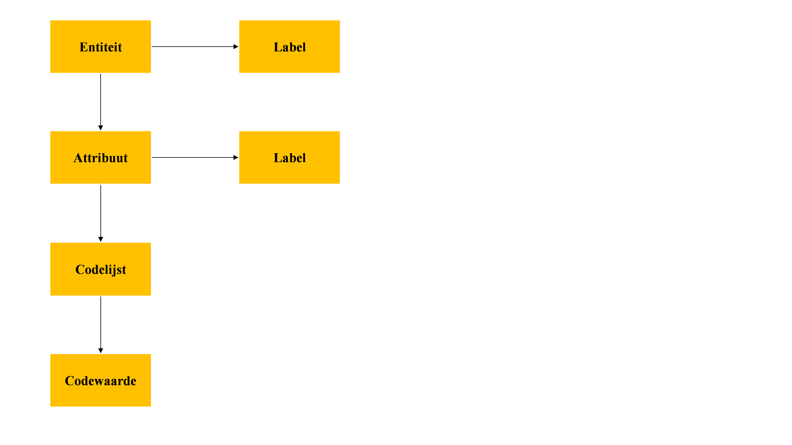
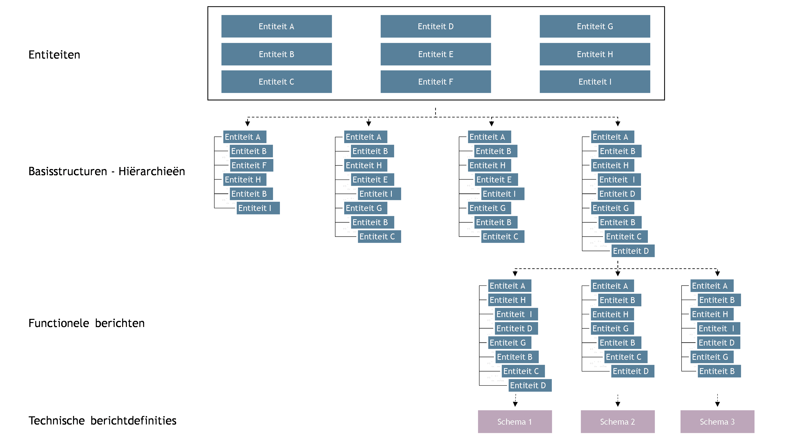

# 5 Approach/Setup of the Data Standard

**In this chapter we explain how we arrive at the specifications of the messages.**

**Steps to arrive at the functional specifications of the messages:**

1.  **Create descriptions of the processes and information flows.**

2.  **Compile a list of entities and associated attributes.**

3.  **Determine the base structure of the messages.**

4.  **Indicate which messages are needed.**

5.  **Create a cross-reference table between the base structure and the messages.**

    **We explain the relationship with SIVI AFS. We use the building blocks from SIVI AFS (AFD 2.0) to arrive at technical specifications.**

## 5.1 Create Descriptions of the Processes and Information Flows

To standardize the interfaces including message exchange between parties in the chain(s), we create descriptions of the various chain processes as they take place, including the desired functionality at the chain actors at a high level. We also indicate which information flows are relevant. Visualized diagrams of the information flows between parties serve as an aid.

**The processes & information flows are described in detail in the report ''[Results of research: Standard for data exchange pension administration & asset management parties''](https://www.pensioenfederatie.nl/cms/streambin.aspx?documentid=18380):**

**Chapter 4: Solidarity Premium Scheme.**

**Chapter 5: Flexible Premium Scheme.**

See also chapter 3 of this manual.

## 5.2 Compile a List of Entities and Associated Attributes

Create definitions of entities and attributes. Where possible, use code lists, with preference for existing code lists. Also indicate the required relationships between data elements. Each entity and each attribute also receives a label at the technical level. The labels are included with their corresponding values in a message. This allows a computer to automatically process the data from the message. Figure 10 shows the building blocks of a data model.

**Figure 10 – Building blocks of the data model**

## 5.3 Determine the Base Structure of the Messages

Also clarify the composition of the messages, for example:

<table>
<tr><td>Entity A</td><td>M</td></tr>
<tr><td>Entity B*</td><td>M, 1… 999</td></tr>
<tr><td style="padding-left: 40px;">Entity C</td><td>M, 1</td></tr>
<tr><td style="padding-left: 40px;">Entity D</td><td>O, 1</td></tr>
</table>

Entity A occurs once, mandatory.

Entity B occurs at least 1 time and at most 999 times.

Entity C is nested under Entity B and occurs once, mandatory.

Entity D is nested under Entity B and occurs at most 1 time.

## 5.4 Indicate Which Messages Are Needed.

Based on the descriptions of the processes and information flows, determine which messages are needed.

## 5.5 Create a Cross-reference Table Between the Base Structure and the Messages.

For each message, indicate in the table which entities/attributes apply. Indicate the number of repetitions (entities) and also indicate which attributes must be filled in. It is also possible to make selections from code lists, meaning to indicate which code values apply.

Figure 11 below shows how we compose multiple base structures from a collection of entities/attributes and how we can derive multiple functional messages from each base structure. Finally, we deliver technical message specifications. Figure 11 illustrates this.

**Figure 11 - From entities to base structure to functional messages to technical message definitions  
**

## 5.6 Relationship with SIVI AFS

The English-language AFD 2.0 is part of the SIVI All Finance Standard. Via [AFD 2.0 Online Raadplegen](https://www.sivi.org/standaarden/sivi-all-finance-standaard/afd-online-2-0/) you can search online for all entities, attributes and code lists. Additionally, you will find an overview of AFD 2.0 in XLS format. Pensions are already present in AFD 2.0 to a certain extent. This is partly related to the mapping that SIVI developed for the [Ockto Data Model](https://www.sivi.org/actueel/persbericht-sivi-en-ockto-brengen-registratie-klantdata-stap-verder/). Ockto has a connection to the pension register. The use of JSON is a foundational principle in AFD 2.0.

AFD 2.0 contains building blocks that we use when specifying the entities and attributes for the data exchange standard between asset management and pension administration. We indicate which AFD 2.0 building blocks we use and which building blocks are missing. SIVI can then add the latter to AFD 2.0. Besides entities/attributes, this may also involve code lists.
